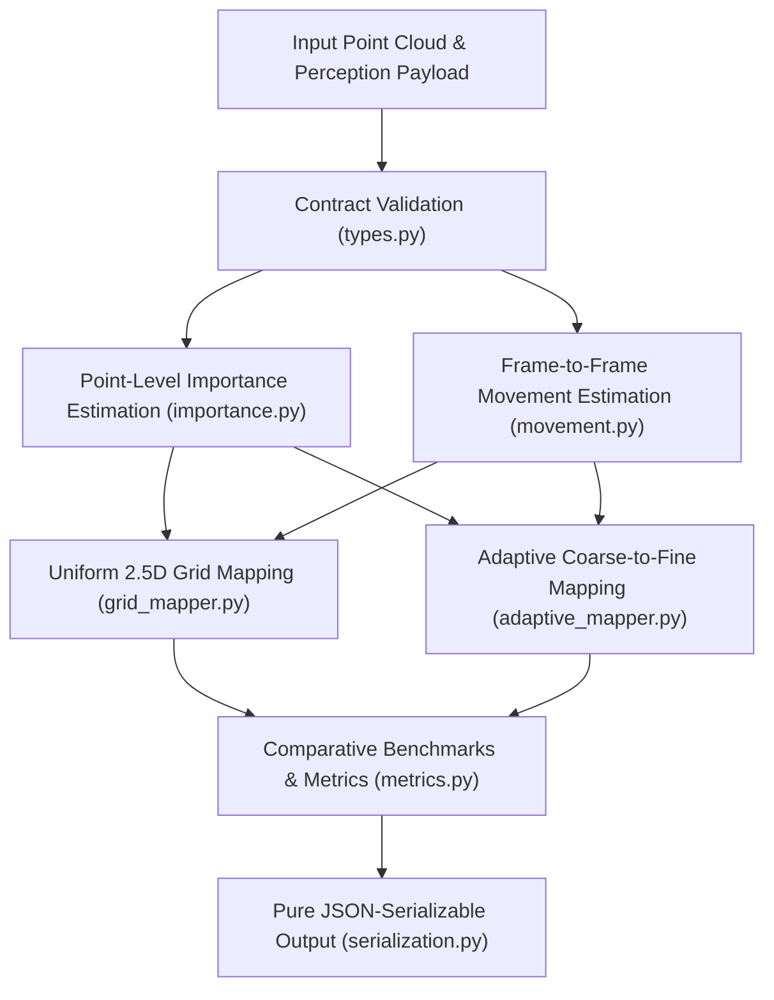

# Member 3 Module Documentation: Adaptive Variable-Resolution 2.5D LiDAR Mapping

**Project:** Adaptive Variable-Resolution 2.5D LiDAR Mapping for Dynamic Environment Perception  
**Role:** Member 3 — Spatial Mapping, Variable Resolution Aggregation & Comparative Benchmarks

---

## 1. Overview and Purpose

The `src/mapping` module provides 2.5D elevation and occupancy grid mapping for autonomous driving LiDAR perception. While classical grid maps discretize the entire surrounding environment at a single uniform resolution (e.g. $0.25\,\text{m}$ everywhere), this approach creates significant memory and compute inefficiencies when processing expansive static surfaces (such as road asphalt or distant building walls).

Member 3 implements an **adaptive coarse-to-fine variable-resolution strategy**:
- Low-importance static regions (e.g., planar roads) are retained at coarse resolution ($1.00\,\text{m}$).
- High-importance vulnerable objects (pedestrians, vehicles, poles) or dynamically moving elements receive fine resolution ($0.25\,\text{m}$).
- Output remains a unified, non-overlapping 2.5D spatial map with guaranteed $1:1$ point conservation.

---

## 2. End-to-End Pipeline Architecture



---

## 3. 2.5D Grid Representation & Mathematical Formulation

### 2.5D Grid Concept
A 2.5D grid decomposes the continuous horizontal $XY$ ground plane into discrete cells while maintaining continuous vertical elevation statistics ($z_{\min}, z_{\max}, \bar{z}, \sigma^2_z$) and semantic distributions inside each cell.

### Stable Floor-Based Cell Indexing
To prevent boundary jitter around the coordinate origin $(0, 0)$, cell indices are computed using floor division with configurable origin offsets:

$$\text{grid\_x} = \left\lfloor \frac{x - x_{\text{origin}}}{\text{resolution}} \right\rfloor, \quad \text{grid\_y} = \left\lfloor \frac{y - y_{\text{origin}}}{\text{resolution}} \right\rfloor$$

$$\text{center\_x} = x_{\text{origin}} + (\text{grid\_x} + 0.5) \cdot \text{resolution}, \quad \text{center\_y} = y_{\text{origin}} + (\text{grid\_y} + 0.5) \cdot \text{resolution}$$

---

## 4. Reusable Cell Aggregation (`cell_aggregator.py`)

For any collection of $N$ points in a cell, the aggregator computes:

| Attribute | Type | Definition / Mathematical Formula |
|---|---|---|
| `point_count` | `int` | $N$ (number of points falling inside cell) |
| `min_height` | `float` | $\min_{i=1..N}(z_i)$ in meters |
| `max_height` | `float` | $\max_{i=1..N}(z_i)$ in meters |
| `mean_height` | `float` | $\bar{z} = \frac{1}{N}\sum_{i=1}^N z_i$ in meters |
| `height_variance` | `float` | $\sigma^2_z = \frac{1}{N}\sum_{i=1}^N (z_i - \bar{z})^2$ ($0.0$ if $N=1$) |
| `dominant_class` | `int` | Semantic class with highest votes ($\arg\max c$). **Deterministic tie breaking: smallest class ID wins.** |
| `class_histogram` | `dict` | Point counts per class ID present in cell |
| `mean_confidence` | `float` | $\bar{s} = \frac{1}{N}\sum_{i=1}^N s_i \in [0.0, 1.0]$ |
| `semantic_purity` | `float` | $\frac{\text{dominant\_class\_count}}{N} \in [0.0, 1.0]$ |

---

## 5. Heuristic Importance Estimation (`importance.py`)

Cell importance is calculated via a multi-criteria linear combination normalized to $[0.0, 1.0]$:

$$\text{Importance} = \frac{w_{\text{sem}} S_{\text{sem}} + w_{\text{unc}} S_{\text{unc}} + w_{\text{den}} S_{\text{den}} + w_{\text{h}} S_{\text{h}} + w_{\text{prox}} S_{\text{prox}}}{w_{\text{sem}} + w_{\text{unc}} + w_{\text{den}} + w_{\text{h}} + w_{\text{prox}}}$$

### Factor Definitions:
1. **Semantic Prioritization ($S_{\text{sem}}$)**:
   - Pedestrians (class 5): $1.00$ (Ultra-Critical)
   - Vehicles (class 4): $0.90$ (Dynamic Critical)
   - Poles & Signs (class 6): $0.70$ (Vertical Obstacle)
   - Buildings (class 2) & Sidewalks (class 1): $0.50$
   - Vegetation (class 3): $0.40$
   - Road (class 0): $0.20$
   - Other/Outliers (class 7): $0.10$
2. **Confidence Uncertainty ($S_{\text{unc}}$)**: $1.0 - \bar{s}$. Uncertain classifications receive higher mapping scrutiny.
3. **Point Density ($S_{\text{den}}$)**: $\min(1.0, N / N_{\text{ref}})$.
4. **Height Variation ($S_{\text{h}}$)**: $\min(1.0, \sigma_z / \sigma_{\text{ref}})$. Indicates complex 3D vertical structure.
5. **Sensor Proximity ($S_{\text{prox}}$)**: $\max(0.0, 1.0 - d / d_{\max})$. Emphasizes safety-critical near-field obstacles.

> [!NOTE]
> **Heuristic Disclosure**: These importance scores are transparent engineering heuristics designed for prototype variable-resolution allocation, NOT learned weights from neural networks.

---

## 6. Movement Estimation (`movement.py`)

Computes frame-to-frame local point displacement using nearest neighbors (`scipy.spatial.cKDTree`):
- For each point $p_t$ in the current frame, queries nearest neighbor $p_{t-1}$ in the previous frame.
- If $\|p_t - p_{t-1}\| > \text{threshold}$ (default $0.25\,\text{m}$), the point is marked as dynamic.
- Returns `mean_displacement`, `max_displacement`, `moving_point_count`, and `moving_point_ratio`.
- **Graceful degradation**: If `previous_points` is omitted or empty, returns `available=False` with safe zeros.

> [!NOTE]
> **Geometric Prototype Disclosure**: This is a direct spatial nearest-neighbor heuristic rather than full SLAM ego-motion compensation or scene-flow tracking.

---

## 7. Adaptive Resolution Strategy (`adaptive_mapper.py`)

1. **Coarse Binning**: Ingests all points into coarse cells of resolution `base_resolution` (e.g., $1.00\,\text{m}$).
2. **Evaluation**: Computes cell importance and movement status for each coarse cell.
3. **Decision**:
   - If `importance >= importance_threshold` OR cell has dynamic points: subdivide into fine subcells (`fine_resolution`, e.g. $0.25\,\text{m}$).
   - Else: preserve at `base_resolution`.
4. **Conservation Invariants**:
   - Subdivided coarse cells are replaced by their fine subcells (no overlapping cells).
   - Exact $1:1$ point accounting: $\sum \text{cell.point\_count} == N_{\text{total}}$.

---

## 8. Map Comparison Metrics (`metrics.py`)

Measures the efficiency gain of adaptive mapping over fine uniform mapping:
- `cell_count_reduction_percent`: $\frac{N_{\text{uniform}} - N_{\text{adaptive}}}{N_{\text{uniform}}} \times 100\%$
- `estimated_memory_reduction_percent`: Reduction in theoretical struct allocation (modeled at 64 bytes per cell).
- `occupied_area_m2`: Total active surface area covered by occupied cells.
- `map_sparsity`: Ratio of unoccupied bounding box space.

---

## 9. Input & Output Contract Examples

### Input Payload
```json
{
  "points": [
    [10.2, 1.4, -0.5, 0.35],
    [10.4, 1.6, -0.4, 0.40]
  ],
  "predicted_labels": [4, 4],
  "confidence_scores": [0.94, 0.91],
  "frame_id": "000001"
}
```

### High-Level Output (`process_frame`)
```json
{
  "frame_id": "000001",
  "uniform_map": {
    "map_type": "uniform",
    "resolution": 0.5,
    "cell_count": 1,
    "cells": [
      {
        "grid_x": 20,
        "grid_y": 2,
        "center_x": 10.25,
        "center_y": 1.25,
        "resolution": 0.5,
        "point_count": 2,
        "min_height": -0.5,
        "max_height": -0.4,
        "mean_height": -0.45,
        "height_variance": 0.0025,
        "dominant_class": 4,
        "class_histogram": {"4": 2},
        "mean_confidence": 0.925
      }
    ],
    "bounds": {"min_x": 10.2, "max_x": 10.4, "min_y": 1.4, "max_y": 1.6, "min_z": -0.5, "max_z": -0.4},
    "point_count": 2
  },
  "adaptive_map": {
    "map_type": "adaptive",
    "base_resolution": 1.0,
    "fine_resolution": 0.25,
    "cell_count": 1,
    "coarse_cell_count": 0,
    "fine_cell_count": 1,
    "cells": [
      {
        "grid_x": 40,
        "grid_y": 5,
        "center_x": 10.125,
        "center_y": 1.375,
        "resolution": 0.25,
        "level": "fine",
        "point_count": 2,
        "mean_height": -0.45,
        "dominant_class": 4,
        "mean_confidence": 0.925,
        "importance_score": 0.812,
        "is_dynamic": false
      }
    ]
  },
  "metrics": {
    "comparison": {
      "cell_count_reduction_percent": 0.0,
      "estimated_memory_reduction_percent": 0.0,
      "resolution_summary": {
        "coarse_cells": 0,
        "fine_cells": 1
      }
    }
  },
  "importance_summary": {"mean": 0.812, "min": 0.805, "max": 0.819, "std": 0.007},
  "movement": {"available": false, "moving_point_count": 0, "moving_point_ratio": 0.0}
}
```

---

## 10. Member 2 Backend Integration Guide

Member 2 can consume Member 3 via two clean mechanisms:

### Option A: Python Service Adapter
```python
from src.backend.services.mapping_service import MappingService

service = MappingService()

# 1. Process perception dictionary or InferenceResponse model
result = service.process_frame(perception_payload, previous_payload=prev_payload)

# 2. Or generate specific maps
uniform_map = service.generate_uniform_map(perception_payload, resolution=0.40)
adaptive_map = service.generate_adaptive_map(
    perception_payload,
    base_resolution=1.00,
    fine_resolution=0.10,
    importance_threshold=0.50,
)
```

### Option B: FastAPI Route Integration
Mount the router into the central FastAPI app:
```python
from fastapi import FastAPI
from src.backend.routers.mapping_router import router as mapping_router

app = FastAPI()
app.include_router(mapping_router)
```
Endpoints exposed:
- `POST /api/v1/map/uniform`
- `POST /api/v1/map/adaptive`
- `POST /api/v1/map/compare`

---

## 11. Running Tests

Run mapping unit tests:
```powershell
pytest -q tests/test_mapping
```

Run complete repository test suites (backend, AI pipeline, mapping):
```powershell
pytest -q tests/test_backend tests/test_ai_data_pipeline.py tests/test_mapping
```
